## **Exploratory Data Analysis for the Trip Dataset**

```{r setup, include = FALSE}
knitr::opts_chunk$set(include = FALSE)
# Load packages
library(funModeling)
library(tidyverse)
library(Hmisc)
library(plyr)
library(dplyr)
library(lubridate)
library(ggplot2)
library(corrplot)
library(stats)

# Read trip.csv file into R
trip_data <- read_csv("trip.csv")

#CODE REVIEW COMMENT: Great idea loading all packages at the start
```


### *First approach to the data* 

```{r EDA_trip, message=FALSE, warning=FALSE, include=FALSE}

# Step 1: First approach to data

glimpse(trip_data)

status(trip_data)

# Noticed there are 70 unique station ids but 74 station names (both start and end stations)

# Looking at unique values in start station name to identify duplicates
unique(sort(trip_data$start_station_name))
# noticed "Post at Kearney" and "Post at Kearny" as well as "Washington at Kearney" and "Washington at Kearny"

# Looking at unique values in end station name to look for duplicates
unique(sort(trip_data$end_station_name))
# "Post at Kearney" and "Post at Kearny" and "Washington at Kearney" and "Washington at Kearney"

# Fixing misspelled station names 

trip_data$start_station_name[trip_data$start_station_name == "Post at Kearny"] <- "Post at Kearney"
trip_data$start_station_name[trip_data$start_station_name == "Washington at Kearny"] <- "Washington at Kearney"

trip_data$end_station_name[trip_data$end_station_name == "Post at Kearny"] <- "Post at Kearney"
trip_data$end_station_name[trip_data$end_station_name == "Washington at Kearny"] <- "Washington at Kearney"

# Found "Broadway at Main" and "Stanford in Redwood City" are both coded under station ID 80
# Combining them into one station name 
trip_data$start_station_name[trip_data$start_station_name == "Broadway at Main"] <- "Stanford in Redwood City"
trip_data$end_station_name[trip_data$end_station_name == "Broadway at Main"] <- "Stanford in Redwood City"


# Found "San Jose Government Center" and "Santa Clara County Civic Center" are both coded under station ID 25
# Combining them into one station name 
trip_data$start_station_name[trip_data$start_station_name == "San Jose Government Center"] <- "Santa Clara County Civic Center"
trip_data$end_station_name[trip_data$end_station_name == "San Jose Government Center"] <- "Santa Clara County Civic Center"

status(trip_data)

```


  In the first approach to the “trip.csv” data set, the “glimpse” function was used to obtain an overview of the data. The data set includes a total of 326,339 observation with 11 variables including: id, duration, start_date, start_station_name, start_station_id, end_date, end_station_name, end_station_id, bike_id, subscription_type and zip_code. 

  The “status” function was then used which indicated that “zip_code” was the only variable with missing values. The zip code variable had 1493 (0.457% of total) missing values and 50 values equal to zero or 0.0153% of total. Since these values were less than 20% missing, they were not problematic and therefore were not removed. Moreover, the data types for each variable were obtained. All variables were set to the correct data type except for start and end dates which were coded as characters. Start and end dates will need to be changed to a date format at a later time. In addition, there were 70 unique start and end station ids, however, 74 unique start and end station names. This finding prompted a deeper analysis of the start and end station names to search for duplicates or misspelled station names. Using the function “unique” two misspelled station names were identified at first glance: "Washington at Kearny" and “Post at Kearny" with the correct spelling being “Kearney”. To fix this issue, the incorrectly spelled stations names were recoded with the correct spelling. Upon a closer examination of the data set, it was observed that “San Jose Government Center" and "Santa Clara County Civic Center" are both coded under station ID 25. In addition, "Broadway at Main” and "Stanford in Redwood City" were both coded under station ID 80. As "Broadway at Main” and “San Jose Government Center" stations are not included in the “station.csv” data set, they were recoded to "Stanford in Redwood City" and "Santa Clara County Civic Center" by their respective corresponding station IDs as it was assumed the names were entered incorrectly by error. The “status” function was then used again to confirm there were now 70 unique stations IDs and 70 unique station (starting and ending) names.

### *Analyzing categorical variables*


#### **Table 1:** *Ten most frequent starting stations overall.* Number of total rides left from each station with the percent of total ride left from each station.

```{r start_freq, fig.height=7.5, message=FALSE, warning=FALSE, include=FALSE}
head(freq(trip_data$start_station_name), 10)
``` 
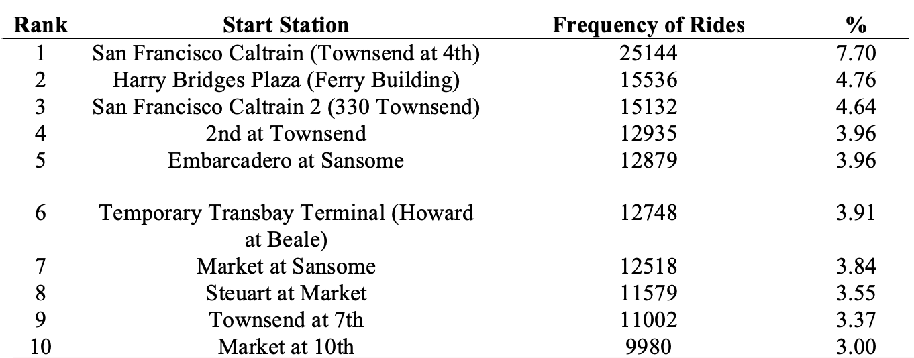
 
 Analysis of categorical variables using the “freq” function from the “funModelling” R package examined the frequency in which starting and ending stations were seen in trip indicated the top 10 most frequent start stations in data to be:  San Francisco Caltrain (Townsend at 4th), Harry Bridges Plaza (Ferry Building), San Francisco Caltrain 2 (330 Townsend), 2nd at Townsend, Embarcadero at Sansome, Temporary Transbay Terminal (Howard at Beale),  Market at Sansome, Steuart at Market, Townsend at 7th, and Market at 4th **(Table 1)** The top 10 ending stations were similar: San Francisco Caltrain (Townsend at 4th),  Harry Bridges Plaza (Ferry Building), San Francisco Caltrain 2 (330 Townsend), Market at Sansome, 2nd at Townsend, Embarcadero at Sansome, Townsend at 7th, Steuart at Market,  Temporary Transbay Terminal (Howard at Beale), and Powell Street BART **(Table 2)**.

#### **Table 2:** *Ten most frequent ending stations overall.* Number of total rides arrived at each station with the percent of total ride arrived at each station.

```{r end_freq, fig.height=7.5, message=FALSE, warning=FALSE, include=FALSE}
head(freq(trip_data$end_station_name), 10)
```
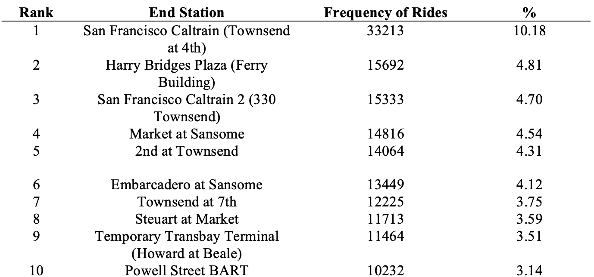


#### **Figure 1:** *Subscription types.*

```{r sub_type, include=FALSE}
freq(trip_data$subscription_type)
```
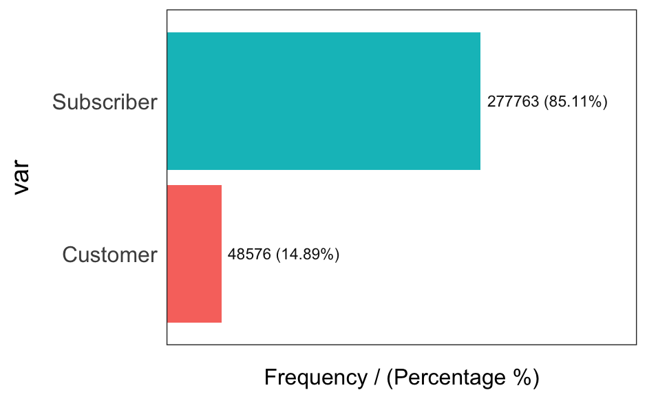
In addition, analysis of the subscription type found that 85.11% of rides are by “Subscribers” and 14.89% of rides are by “Customers”, those without a subscription **(Figure 1).** 

### *Analyzing numerical variables and addressing outliers*

```{r cat_num_analysis, message=FALSE, warning=FALSE}
# Step 3: Analyzing numerical variables - plot_num(trip_data)

# Runs for all numerical/integer variables automatically
profiling_num(trip_data$duration)
describe(trip_data$duration)
```

Analysis of numerical variables using the “describe” function from the “Hmisc” R package was done to obtain information about the trip durations. The mean value of trip duration was of trips in the dataset was 1131.967 sec, with the five highest durations being 644 771, 715 339, 716 480, 720 454, and 1 727 040 seconds long and the five lowest durations all being approximately 60 seconds or less. Here, trips that were less than 2 minutes (120 seconds long) were removed from the data set using the filter function from the “tidyverse” package; about 2,499 observations were removed from the dataset after completing this step. 

#### **Figure 2:** *Histogram of trip durations in seconds.* Note frequencies at each end of the range are large due to the reassignment of outliers to upper and lower limits.

```{r outliers_trip, message=FALSE, warning=FALSE, include=FALSE}
# Find the number of cancelled trips (<2min) and remove from data set 

# Filter rows more than 120s 
trip_clean <- trip_data %>%
  filter(duration >= 120)

# removed 2,499 trips

# Evaluating the outliers in "duration"

iqr_trip <- IQR(trip_clean$duration)
# 404

Q1 <- quantile(trip_clean$duration, .25)
Q3 <- quantile(trip_clean$duration, .75)

# Assigning an upper and lower range
up <- 1.5*iqr_trip + Q3 # Upper Range  

low <- 1.5*iqr_trip - Q1 # Lower Range

# trip_clean = 323,840 obs
trip_clean2 <- trip_clean

# Assigning any values higher and upper lower limits to be the calculated upper and lower limits to prevent data loss
trip_clean2$duration[trip_clean2$duration > up] <- up 
trip_clean2$duration[trip_clean2$duration < low] <- low

# trip_clean2 = 65,195 outliers were assigned as upper and lower limits instead of removing

# Plot histogram of the duration in seconds 
hist(trip_clean2$duration, main = "Histogram of Trip Duration", xlab = "Trip Duration in Seconds")

# Step 4: Analyzes numerical and categorical at the same time - 

describe(trip_clean2$duration)
describe(trip_clean2)

# Check min and max values (outliers)
# Check Distributions (same as before)

# Saving trip_clean2 as an RDS file
saveRDS(trip_clean2, "trip_clean2.rds")
```

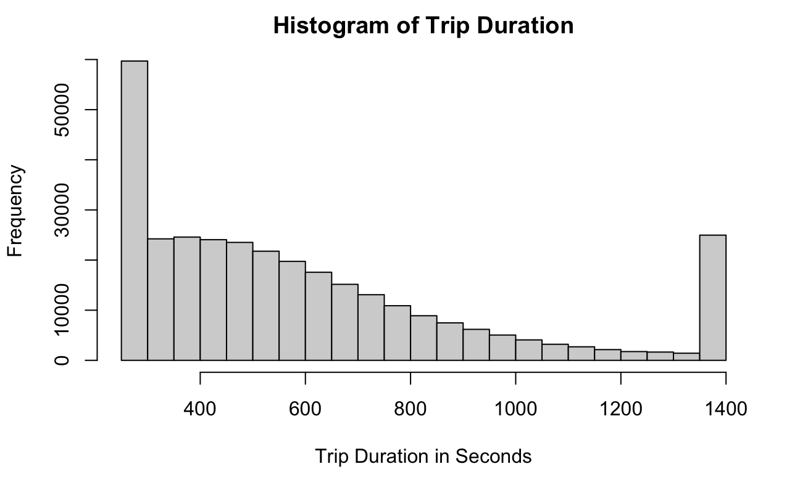

Outliers were identified using the equation 1.5 x IQR + Q3 for identifying the upper limits and 1.5 x IQR - Q1 for identifying the lower limits. There were approximately 65,195 outliers if the upper and lower limits were to be removed. To prevent loss of a massive number of data points the outliers were identified and reassigned to be the upper and lower limits as opposed to removing them entirely. A histogram of duration trip frequency was created to examine the distribution and to check for any extreme skewedness **(Figure 2)**. Using the “describe” function from the “ Hmisc” package a final check of the data was done to ensure outliers had been addressed. After modifying outliers to be either upper or lower limits, the new mean of trip duration was 598.9 seconds. The modified trip data set was named “trip_clean2” and saved as a RDS file for later use.

## **Exploratory Data Analysis for Weather Dataset**

```{r EDA_weather, message=FALSE, warning=FALSE, include=FALSE}

#Uploading weather.dataset and assigning to weather_df object
weather_df <- read.csv("weather.csv")

#Overview on variables from each column and few observations
glimpse(weather_df)

#Profiling the data input 
status(weather_df)

#performing necessary transformations before visualization
weather_df_1 <- weather_df %>% 
  #changing date-column from character to as.date type 
  mutate(date = as.POSIXct(date, format="%d/%m/%y")) %>%
  #replacing T-values in precipitation column with 0 
  mutate (precipitation_inches = str_replace(precipitation_inches, pattern="T", replacement="0")) %>% 
  #changing precipitation from character to numeric  
  mutate (precipitation_inches = as.numeric(precipitation_inches)) %>%
  #changing cloud cover variable from character to factor  
  mutate (cloud_cover = as.factor(cloud_cover)) %>%
  #changing events to character type 
  mutate (events = as.character(events)) %>%
  #recoding "" in events to NA 
  mutate (events = na_if(x=events, y="")) %>%
  #changing events to be coded as factor
  mutate (events = as.factor(events)) %>%
  #changing zipcode to be coded as factor
  mutate (zip_code = as.factor(as.character(zip_code))) %>%
  #changing city to be coded as factor 
  mutate (city = as.factor(city)) %>% 
  #changing max_visibility_miles to be coded as numeric 
  mutate (max_visibility_miles = as.numeric(max_visibility_miles)) %>% 
  #changing mean_visibility_miles to be coded as numeric 
  mutate (mean_visibility_miles = as.numeric(mean_visibility_miles)) %>% 
  #changing max_wind_Speed_mph to be coded as numeric 
  mutate (max_wind_Speed_mph = as.numeric(max_wind_Speed_mph)) %>% 
  #changing max_gust_speed_mph to be coded as numeric 
  mutate (max_gust_speed_mph = as.numeric(max_gust_speed_mph)) %>%
  #changing mean_wind_speed_mph to be coded as numeric 
  mutate (mean_wind_speed_mph = as.numeric(mean_wind_speed_mph)) %>% 
  #changing min_visibility_miles to be coded as numeric 
  mutate (min_visibility_miles = as.numeric(min_visibility_miles)) %>%
  #changing max_temperature_f to be coded as numeric 
  mutate (max_temperature_f = as.numeric(max_temperature_f)) %>% 
  #changing mean_temperature_f to be coded as numeric 
  mutate (mean_temperature_f = as.numeric(mean_temperature_f)) %>% 
  #changing min_temperature_f to be coded as numeric 
  mutate (min_temperature_f = as.numeric(min_temperature_f)) 
  
str(weather_df_1)

#full univariate analysis being performed 
profiling_num(weather_df_1)

#provides summary on both numerical and categorical data 
describe(weather_df_1)

#writing modified_weaher_data into weather_transform csv file
saveRDS(weather_df_1, "weather_transform.rds")

```


### *First approach to the data*

To initiate our exploration of the weather.csv file, the “glimpse” function from the dplyr package was used to obtain an overview of all the variables from the weather dataset. In this primary step, the following details were noted: The date column was formatted in character-form instead of as date form, which necessitated a modification to the latter form. In addition, the max_temperature_f, mean_temperature_f and min_temperature_f variables, along with the max_visibility_miles, mean_visibility_miles, min_visibility_miles variables, and the max_wind_Speed_mph, mean_wind_speed_mph, max_gust_speed_mph variables were provided in integer form. These would need to be coded to numeric form for future analyses, such as correlation plots. Moreover, the precipitation (inches) was incorrectly coded as characters instead of integers, due to the fact that there were a few values coded as “T”. This value encodes “trace” for trace-amounts of precipitation, and would need to be changed to 0. The cloud-cover variable seems to be coded as an integer but could be coded as a factor as there are different categories of cloud-cover. In addition, the events variable seem to be properly coded as characters, however the output also indicated that there are some variables coded as “ “ which would need to be changed to NA. The zipcode variable is also correctly coded as an integer, but should be coded as a factor. Based on this initial examination, the variables were recoded and reformatted before performing any of the future steps of the EDA. 


### *Analyzing categorical variables*

```{r weath_cat, message=FALSE, warning=FALSE, include=FALSE}
freq(weather_df_1)
```


#### **Figure 3:** *Assessment of Categorical Variables.* A) Frequency of Weather Events (Top) B) Frequency of Dates for Each City (Bottom).

```{r weather_1, echo=FALSE}
freq(weather_df_1)
```

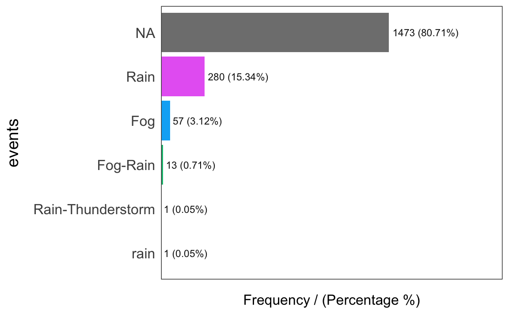

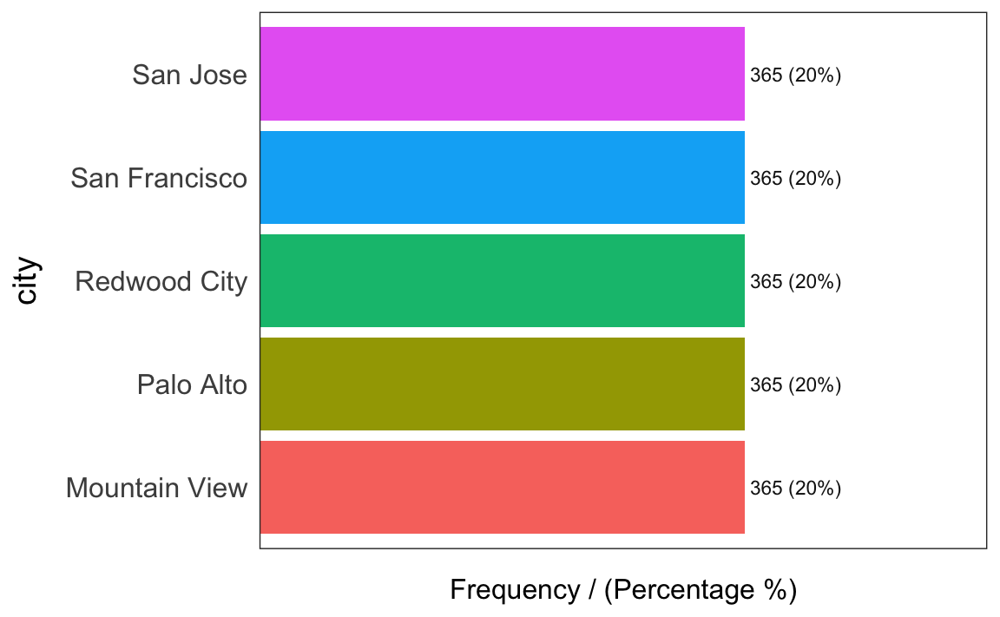

The next approach to the exploratory analysis involved performing an assessment of the categorical data through the “freq” function. There were only a few categorical variables assessed, these encompassed the cloud_cover, events, zip_code and city variables and the most relevant plots are shown here. The output revealed that there were 9 levels of the cloud_cover variable, ranging in frequency with 0-cloud cover being the most frequent and 8-cloud_cover category as being the least frequent as shown in **Figure 3A**. In addition, the events variable indicated that 80.71% (representing 1473 data values) of the data was composed of NA-values, with the next most frequent events composing of rain and fog. Lastly, there were 5 levels associated with the cities, related to the 5 levels of zipcodes, which are evenly distributed in frequency, as shown by **Figure 3B**. 

### *Analyzing Numerical Variables*

#### **Figure 4:** *Assessment of Numerical Variables.* The minimum-visibility (miles), maximum-gust-speed (mph), max_gust_speed_mph and precipitation_inches variables display skewed-distributions.


```{r weather_2, message=FALSE, warning=FALSE, include=FALSE}
plot_num(weather_df_1)
```

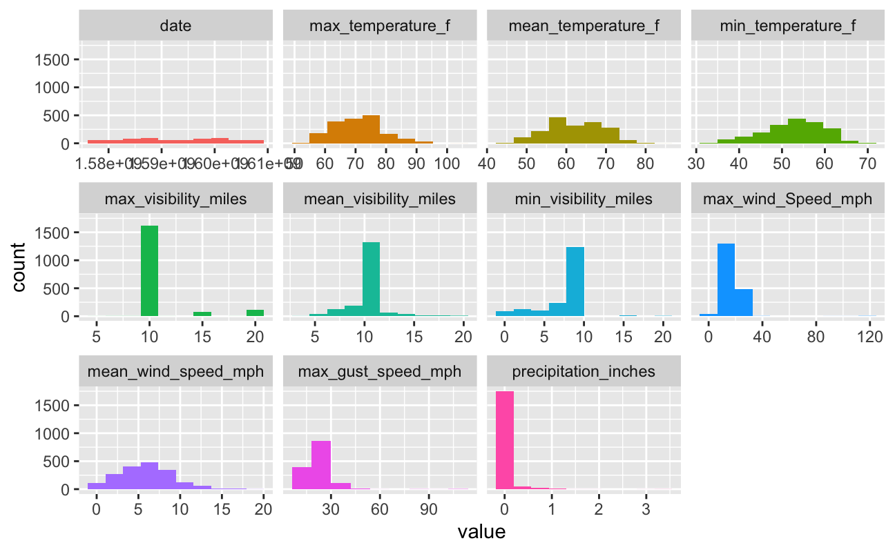
After assessing the categorical variables, the variables remaining were numerical in form, and were thus explored through the plot_num function. For this function, barplots were provided for all the numerical variables, which helped us develop initial insights into each of variables as can be seen in **Figure 4**. The minimum-visibility (miles), maximum-gust-speed (mph) variables, along with max_gust_speed_mph and precipitation_inches variables show relatively skewed and unbalanced distributions which can be attributed to the presence of outliers that would need to be removed, supporting previous analyses. The remaining numerical variables seem to have a relatively normal distribution, without any discerning outliers. 

After plotting the numerical variables, the profiling-num function was performed to obtain an understanding of each variable’s distribution and range. This function demonstrated that there is a high standard deviation for the max_temperature_f, mean_temperature_f, min_temperature_f, max_wind_Speed_mph and max_gust_speed_mph variables. In addition, the variation coefficient demonstrated that the precipitation_inches variable is associated with more variance as opposed to the remaining variables that are centered around the mean, inferring less accuracy associated with this variable if it were to be chosen as a possible predictor. The skewness metric informs on the measure of asymmetry, and this function demonstrated that the variables of max_visibility_miles, mean_visibility_miles, max_wind_Speed_mph, max_gust_speed_mph and precipitation_inches variables have greater skewness-values and therefore greater likelihood of observing outliers in these variables. The kurtosis variable describes the distribution for the tails, where higher number indicates presence of outliers, and this was demonstrated by the higher values shown for the max_visibility_miles, mean_visibility_miles, max_wind_Speed_mph, max_gust_speed_mph and precipitation_inches variables. There was also a high IQR range for the max_temperature_f, mean_temperature_f, and min_temperature_f variables obtained.  

The describe function was used to obtain an overall overview of both the numerical and categorical variables. The date-column has 144 unique values but 720 dates available, with the remaining 1105 values being missing values and representing 60.5% of the date-data. These values range from 2020-01-10 to 2020-12-12. Since this date-data is being used for combining with the trip-data based on date, values with missing dates will be removed. The max_temperature_f column has 46 unique values, ranging from 50 to 102. For the mean_temperature_f variable, there are 37 distinct values ranging from 44 to 84, and similarly, there are 37 distinct values for the min_temperature_f variable, ranging from 32 to 69. The max_visibility_miles has 9 missing values, and 9 distinct values ranging from 5 to 20. This variable was also shown to have many outliers, which will need to be removed. The related column of mean_visibility_miles has 9 missing values, and 17 distinct values ranging from 4 to 20, the higher values representing outlier-values will also will be removed. The min_visibility_miles variable has 9 missing values and 17 distinct values ranging from 4 to 20, but this column does not have any outliers as shown by previous analyses. The max_wind_Speed_mph variable has no missing values, but 34 distinct values ranging from 4 to 122, and this variable has been noted to contain outliers, which will be removed. The mean_wind_speed_mph variable has no missing values, but 20 distinct values ranging from 0 to 19, but no presence of outliers. The max_gust_speed_mph variable has 451 missing values, and 43 distinct-events, ranging from 6 to 114, and previous analyses indicate this variable has outliers which will be removed. For the precipitation inches variable, there are 74 unique values ranging from 0 to 3.36, but this variable has been noted to contain outlier values, which will be removed. For the cloud-cover variable, there are no missing values and 9 distinct events ranging from 0 to 8, with no discernable outliers according to previous analyses. For the event variable, there are 5 distinct-events however with 1473 missing values. For the zip-code variable, there are 0 missing values but 5 distinct events. This variable is also similar to the output from the city-variable, which retrieved 0 missing values but 5 distinct events, with both of these variables retrieving equivalent proportions for the frequency of each of the values. For the variables with missing values which are the date, max_visibility_miles, mean_visibility_miles, min_visibility_miles, max_gust_speed_mph and events variables, the missing-values were not recoded to 0 or other values such as mean/minimum/maximum as these entries instead represent events where values were simply not observed and recorded, and it would be incorrect to impute values in place of them. 


### *Addressing outliers*

```{r outliers_weather, message=FALSE, warning=FALSE, include=FALSE}
#Outlier Removal for Weather

#reading in weather and data, assigning to weather_df object
weather_df <- readRDS("weather_transform.rds")

#removing NA values for unavailable dates, assigning to weather_df_2
weather_df_2 <- weather_df %>% filter(!is.na(date))

#EDA indicated presence of outliers in the following variables: max_visibility_miles, 
#mean_visibility_miles, max_wind_Speed_mph, max_gust_speed_mph and precipitation_inches 

#outliers being removed based on the IQR method 
#outlier removal attempt for max_visibility_miles, indicates that both upper and lower limit are the same 
quartile_max_visibility_miles <- quantile(weather_df_2$max_visibility_miles, probs=c(.25, .75), na.rm = T)
iqr_max_visibility_miles <- IQR(weather_df_2$max_visibility_miles, na.rm=T)
upper_lim_max_visibility_miles <- quartile_max_visibility_miles[2] + 1.5*iqr_max_visibility_miles
lower_lim_max_visibility_miles <- quartile_max_visibility_miles[1] - 1.5*iqr_max_visibility_miles 
#outlier removal based on percentiles:
upper_lim_max_visibility_miles <- quantile(weather_df_2$max_visibility_miles, 0.975, na.rm=T)
lower_lim_max_visibility_miles <- quantile(weather_df_2$max_visibility_miles, 0.025, na.rm=T)

#number of lower-limit outliers recoded
sum(weather_df_2$max_visibility_miles < as.numeric(lower_lim_max_visibility_miles), na.rm=T)

#number of higher-limit outliers recoded
sum(weather_df_2$max_visibility_miles > as.numeric(upper_lim_max_visibility_miles), na.rm=T)

#recoding of both outliers 
weather_df_2 <- weather_df_2 %>% 
  mutate(max_visibility_miles = case_when(max_visibility_miles > as.numeric(upper_lim_max_visibility_miles) ~ as.numeric(upper_lim_max_visibility_miles), TRUE ~ max_visibility_miles)) %>% 
  mutate(max_visibility_miles = case_when(max_visibility_miles < as.numeric(lower_lim_max_visibility_miles) ~ as.numeric(lower_lim_max_visibility_miles), TRUE ~ max_visibility_miles))

#not removed for mean_visibility_miles due to outer and lower bounds being the same 
quartile_mean_visibility_miles <- quantile(weather_df_2$mean_visibility_miles, probs=c(.25, .75), na.rm = T)
iqr_mean_visibility_miles <- IQR(weather_df_2$mean_visibility_miles, na.rm=T)
upper_lim_mean_visibility_miles <- quartile_mean_visibility_miles[2] + 1.5*iqr_mean_visibility_miles
lower_lim_mean_visibility_miles <- quartile_mean_visibility_miles[1] - 1.5*iqr_mean_visibility_miles 
#outlier removal based on percentiles:
upper_lim_mean_visibility_miles <- quantile(weather_df_2$mean_visibility_miles, 0.975, na.rm=T)
lower_lim_mean_visibility_miles <- quantile(weather_df_2$mean_visibility_miles, 0.025, na.rm=T)

#number of lower-limit outliers recoded
sum(weather_df_2$mean_visibility_miles < as.numeric(lower_lim_mean_visibility_miles), na.rm=T)

#number of higher-limit outliers recoded
sum(weather_df_2$mean_visibility_miles > as.numeric(upper_lim_mean_visibility_miles), na.rm=T)

#recoding of outliers 
weather_df_2 <- weather_df_2 %>% 
  mutate(mean_visibility_miles = case_when(max_visibility_miles > as.numeric(upper_lim_mean_visibility_miles) ~ as.numeric(upper_lim_mean_visibility_miles), TRUE ~ mean_visibility_miles)) %>% 
  mutate(mean_visibility_miles = case_when(max_visibility_miles < as.numeric(lower_lim_mean_visibility_miles) ~ as.numeric(lower_lim_mean_visibility_miles), TRUE ~ mean_visibility_miles))


#outliers removed for max_wind_Speed_mph due to outer and lower bounds being different 
quartile_max_wind_speed_mph <- quantile(weather_df_2$max_wind_Speed_mph, probs=c(.25, .75), na.rm = T)
iqr_max_wind_Speed_mph <- IQR(weather_df_2$max_wind_Speed_mph, na.rm=T)
upper_lim_max_wind_Speed_mph <- quartile_max_wind_speed_mph[2] + 1.5*iqr_max_wind_Speed_mph
lower_lim_max_wind_Speed_mph <- quartile_max_wind_speed_mph[1] - 1.5*iqr_max_wind_Speed_mph 

#number of lower-limit outliers recoded
sum(weather_df_2$max_wind_Speed_mph < as.numeric(lower_lim_max_wind_Speed_mph), na.rm=T)

#number of higher-limit outliers recoded
sum(weather_df_2$max_wind_Speed_mph > as.numeric(upper_lim_max_wind_Speed_mph), na.rm=T)

#recoding of outliers  for max_wind_Speed_mph variable to upper IQR limit if higher-than upper limit, else recoding to lower limit 
weather_df_2 <- weather_df_2 %>%
  mutate(max_wind_Speed_mph = case_when(max_wind_Speed_mph > as.numeric(upper_lim_max_wind_Speed_mph) ~ as.numeric(upper_lim_max_wind_Speed_mph), TRUE ~ max_wind_Speed_mph)) %>% 
  mutate(max_wind_Speed_mph = case_when(max_wind_Speed_mph < as.numeric(lower_lim_max_wind_Speed_mph) ~ as.numeric(lower_lim_max_wind_Speed_mph), TRUE ~ max_wind_Speed_mph))

#outliers removed for max_gust_speed_mph due to outer and lower bounds being different 
quartile_max_gust_speed_mph <- quantile(weather_df_2$max_gust_speed_mph, probs=c(.25, .75), na.rm = T)
iqr_max_gust_speed_mph <- IQR(weather_df_2$max_gust_speed_mph, na.rm=T)
upper_max_gust_speed_mph <- quartile_max_gust_speed_mph[2] + 1.5*iqr_max_gust_speed_mph
lower_max_gust_speed_mph <- quartile_max_gust_speed_mph[1] - 1.5*iqr_max_gust_speed_mph 

#number of lower-limit outliers recoded
sum(weather_df_2$max_gust_speed_mph < as.numeric(lower_max_gust_speed_mph), na.rm=T)

#number of higher-limit outliers recoded
sum(weather_df_2$max_gust_speed_mph > as.numeric(upper_max_gust_speed_mph), na.rm=T)

#recoding of outliers  for max_gust_speed_mph variable to upper IQR limit if higher-than upper limit, else recoding to lower limit 
weather_df_2 <- weather_df_2 %>% 
  mutate(max_gust_speed_mph = case_when(max_gust_speed_mph > as.numeric(upper_max_gust_speed_mph) ~ as.numeric(upper_max_gust_speed_mph), TRUE ~ max_gust_speed_mph)) %>% 
  mutate(max_gust_speed_mph = case_when(max_gust_speed_mph < as.numeric(lower_max_gust_speed_mph) ~ as.numeric(lower_max_gust_speed_mph), TRUE ~ max_gust_speed_mph))

#outliers not removed for precipitation  due to outer and lower bounds being the same 
quartile_precipitation <- quantile(weather_df_2$precipitation_inches, probs=c(.25, .75), na.rm = T)
iqr_precipitation <- IQR(weather_df_2$precipitation_inches, na.rm=T)
upper_precipitation <- quartile_precipitation[2] + 1.5*iqr_precipitation
lower_precipitation <- quartile_precipitation[1] - 1.5*iqr_precipitation 
#outlier removal based on percentiles:
upper_precipitation <- quantile(weather_df_2$precipitation_inches, 0.975, na.rm=T)
lower_precipitation <- quantile(weather_df_2$precipitation_inches, 0.025, na.rm=T)

#number of lower-limit outliers recoded
sum(weather_df_2$precipitation_inches < as.numeric(lower_precipitation), na.rm=T)

#number of higher-limit outliers recoded
sum(weather_df_2$precipitation_inches > as.numeric(upper_precipitation), na.rm=T)

weather_df_2 <- weather_df_2 %>% 
  mutate(precipitation_inches = case_when(precipitation_inches > as.numeric(upper_precipitation) ~ as.numeric(upper_precipitation), TRUE ~ precipitation_inches)) %>% 
  mutate(precipitation_inches = case_when(precipitation_inches < as.numeric(lower_precipitation) ~ as.numeric(lower_precipitation), TRUE ~ precipitation_inches))

saveRDS(weather_df_2, "weather_no_outliers.rds")

```


The previous exploratory analyses were helpful in uncovering the variables that necessitated outlier-removal in order to ensure high accuracy of future results. Firstly, we initially removed all the available data were date-information was not available for reasons explained previously.  The method of removing outliers was consistent for many of the same variables from the trip-dataset, with some exceptions, where outliers were identified using the equation 1.5 x IQR + Q3 for identifying the upper limits and 1.5 x IQR - Q1 for identifying the lower limits. To start, the IQR quantile and IQR functions were applied on the variable of max_visibility_miles, but since identical values for both the upper limit and lower limit were retrieved, therefore instead, another method of outlier recoding was used. This method that was used was the percentile-method, where data values were recoded to the lower and upper limits if observation values were beyond the 2.5%  or 97.5% percentile respectively. This alternative approach allowed for the successful recoding of 2 lower-limit outliers and 0 for upper limit of max_visibility_miles. Similarly for the mean_visibility_miles variable, identical values for the upper limit and lower limit were retrieved, and the percentile method of outlier removal was performed. This allowed for the recoding of 9 lower-limit values and 12 higher-limit values. The determination of disparate values for the upper and lower limit for the variable of max_wind_Speed_mph was also successful, allowing for those outlier-values to be recoded from the dataset based on the IQR method. There were 2 lower-limit outliers recoded and 23 higher-limit outliers recoded. The IQR method of outlier removal was also successful for the max_gust_speed_mph variable allowing for the recoding of 0 lower-limit but 18 higher limit outliers. Finally, the method of outlier removal based on percentiles was used for the variable of precipitation_inches, allowing for 0 lower-limit but 18 higher-limit outliers to be recoded.


## **Outliers for the Station Dataset**

```{r station_outliers, include=FALSE}

#reading in station file 
station_df <- read.csv("station.csv")

#structure of file 
str(station_df)

#summary of file 
summary(station_df)

#determining number of unique station-names from station-file 
nrow(unique(station_df))

#reading in trip file
trip_file <- read.csv("trip.csv")
#determining number of unique station-names from trip-file
length(unique(trip_file$end_station_name))

#determining which stations have not been coded in station_file with anti_join function
#the trip_file was used as the left-file because it has greater values 
unique_stations_end <- anti_join(trip_file,station_df, by=c("end_station_name" = "name"))
#the stations not encoded in station_file were retrieved with unique function
unique(unique_stations_end$end_station_name)
```

Alongside the weather and data-files, the station file was also examined. With the structure function, the station file was found to provide many insights. To note, the id-variables were correctly coded as numeric and station name and city variables were correctly coded in character form. Additionally, the latitude and longitude variables were also correctly coded as numeric alongside the dock-count variable. However, the installation-dates were coded as characters. In order to identify any outliers in association to the main trip-file, the number of unique rows was determined, which was retrieved to be 70. After this, the number of unique stations was determined within the trip-file was determined by using the end-station-name, although this could have been replaced with start-station-name. This resulted in the total output of 74 unique values. This value’s discrepancy with the value from the station file suggested that there were 4 additional values that had been improperly coded in the trip-data file. In order to determine which station-names had been improperly coded in the trip-data, an anti-join function was applied with the trip-data and the station-file data to determine which station-names did not match with the station-data. This function found that the San Jose Government Center,  Broadway at Main, Washington at Kearny and Post at Kearny values had not been provided in the station-data and must have been therefore, been improperly coded in the trip-file data.   


## **Rush-Hours and 10-Most Frequent Starting/Ending Stations**

### *Establishing the Highest Volume Hours on Weekdays*

```{r vol_weekds, message=FALSE, warning=FALSE, include=FALSE}
trip_clean2<- readRDS("trip_clean2.rds")

# Establish the highest volume hours on weekdays. Use to build 'rush hours' into their model (lubridate package).
# Have to find the hours of weekdays where the trip volume is highest (eg. can try histograms). Just trip.

# Convert format of start_date and end_date

# So date will be recognized as a date
# Attempted to mutate data and input format as "%d/%m/%y %H:%M" but dates are returning NA
as.POSIXct(trip_clean2$start_date, format="%m/%d/%Y %H:%M")
as.POSIXct(trip_clean2$end_date, format="%m/%d/%Y %H:%M")

rush_hours <- trip_clean2 %>%
  mutate(start_date_for = mdy_hm(start_date)) %>%
  # Removes Sun (1) and Sat (7) from data
  filter(wday(start_date_for) >= 2 & wday(start_date_for) <= 6) %>%
  mutate(hrs = hour(mdy_hm(start_date))) %>%
  group_by(hrs)
 
# Examining rush hours using a table
table(rush_hours$hrs)
```

#### **Figure 5:** *Histogram representing the most frequent times to start trips.* Hours of 8:00 - 8:59 am, 5:00 - 5:59pm, and 9:00 - 9:59 am are the most frequent times for riders to start their trip on weekdays.

```{r hist_rush_hours, include=FALSE}
hist(rush_hours$hrs, main = "Histogram of Rush Hours During Weekdays", xlab = "Hour of Day", xlim = c(0,24))
```
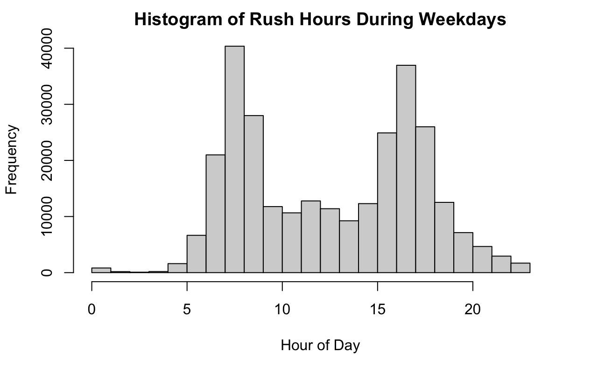
The modified “trip_clean2.rds” was imported and will be the main analysis on the trip data set moving forward. In order to establish highest volume hours on weekdays, the start and end trip dates first had to be recognizable as dates. Using the “as.POSIXct” function the dates were converted from characters to dates. A new data frame called “rush_hours” was created, and using the “tidyverse” package, weekends, which were assigned value of 1 (for Sunday) and 7 (for Saturday) using the “wday” function, were filtered out from the starting dates in the data frame. A new column of hours, corresponding to the time in the starting dates column was created and data was grouped by starting hour. Through closer investigation by the “table” function and by using a histogram to model the data, the hours of 8:00 - 8:59am, 5:00 - 5:59pm, and 9:00 - 9:59am were the most popular times to start trips on weekdays **(Figure 5)**. Starting times were chosen to represent rush hours as this would be the times that customers were picking up bikes and would therefore be the times when the shop is most busy.

Rush hours of 8:00 - 8:59 am, 5:00 - 5:59pm, and 9:00 - 9:59 am on weekdays are expected values as they closely align with the workday patterns of the average 9:00am to 5:00pm worker. In addition, the least common times to start a trip are between the hours of 1:00am - 4:00 am, which are hours when most people tend to be asleep. 

## *Determining the 10 Most Frequent Starting and Ending Stations on Weekdays*


```{r vol_weekds2, include=FALSE}
# Determine the 10 most frequent starting stations and ending stations during the ‘rush hours’.

# Most frequent starting stations during rush hours on weekdays
rush_hours2 <- trip_clean2 %>%
  mutate(start_date_for = mdy_hm(start_date)) %>%
  # Removes Sun (1) and Sat (7) from data
  filter(wday(start_date_for) >= 2 & wday(start_date_for) <= 6) %>%
  mutate(hrs = hour(mdy_hm(start_date))) %>%
  group_by(hrs) %>%
  filter(hrs == 8| hrs == 17 | hrs == 9) %>%
  group_by(start_station_name)

rush_hours2_tb <- table(rush_hours2$start_station_name)

rush_hours2_tb1 <- head(rush_hours2_tb[order(rush_hours2_tb,decreasing = TRUE)],10)

```

#### **Table 3:** *Ten most frequent starting stations on weekdays.* Frequency of rides represents the numbers of trips left at each starting station during rush hours on weekdays.

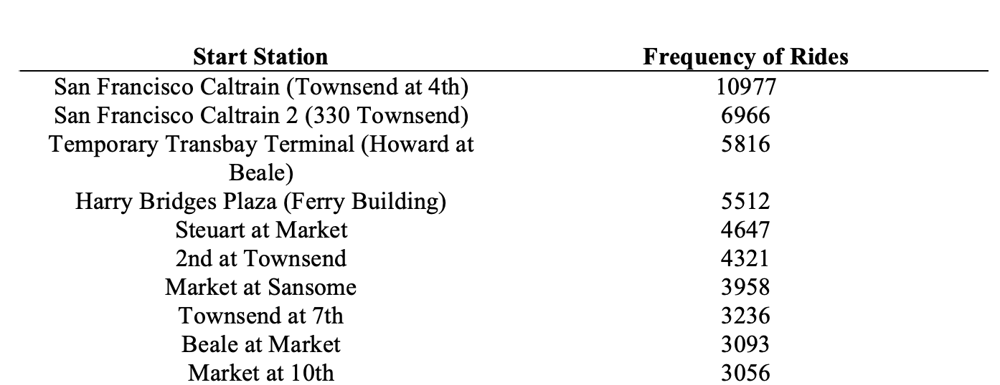


In order to determine the 10 most frequent starting stations on weekdays during rush hours, the same steps were followed as to establish the rush hours for ending stations. The data frame was then grouped by starting station name and then only trips leaving at hours between 8:00 - 8:59 am, 9:00 - 9:59 am and 5:00 - 5:59 pm were included in the analysis. The starting stations and their corresponding frequencies were then put in table format and ordered from most to least frequent in terms of number of trips left during the previously specified hours. The top 10 starting stations at rush hours were:  San Francisco Caltrain (Townsend at 4th), San Francisco Caltrain 2 (330 Townsend), Temporary Transbay Terminal (Howard at Beale), Harry Bridges Plaza (Ferry Building), Steuart at Market, 2nd at Townsend, Market at Sansome, Townsend at 7th, Beale at Market, and Market at 10th **(Table 3)**.


#### **Table 4:** *Ten most frequent ending stations on weekdays.* Frequency of rides represents the numbers of trips arriving at each ending station during rush hours on weekdays.

```{r freq_end_weekd, include=FALSE, paged.print=FALSE}

# Most frequent ending stations during rush hours on weekdays
# Determine rush hours for ending stations
rush_hours3 <- trip_clean2 %>%
  mutate(end_date_for = mdy_hm(end_date)) %>%
  # Removes Sun (1) and Sat (7) from data
  filter(wday(end_date_for) >= 2 & wday(end_date_for) <= 6) %>%
  mutate(hrs = hour(mdy_hm(end_date))) %>%
  group_by(hrs) %>% 
  group_by(end_station_name)

table(rush_hours3$hrs)

rush_hours3 %>%
  # Filtering for identified rush hours
  filter(hrs == 8| hrs == 17 | hrs == 9)
  
rush_hours3_tb <- table(rush_hours3$end_station_name)
rush_hours3_tb1 <- head(rush_hours3_tb[order(rush_hours3_tb,decreasing = TRUE)],10)
```

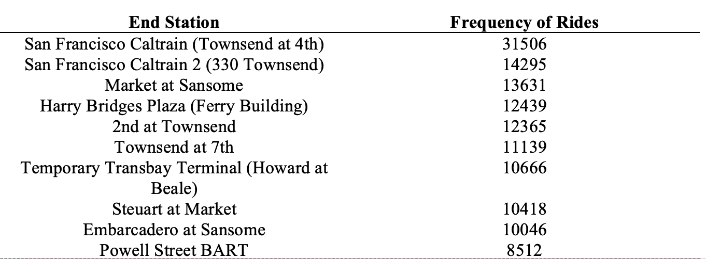

To determine the 10 most frequent ending stations during rush hours on weekdays the same process to determine rush hours for starting stations was followed. This analysis returned the same rush hours at the ending stations as the starting stations being: 8:00 - 8:59 am, 9:00 - 9:59 am and 5:00 - 5:59 pm. The new data frame for frequencies of ending stations during weekdays was then filtered to only include rush hours and then made into a table, using the “table” function and ordered from most to least frequent. In order, the top 10 most frequent ending stations during rush hours on weekdays were: San Francisco Caltrain (Townsend at 4th), San Francisco Caltrain 2 (330 Townsend), Market at Sansome, Harry Bridges Plaza (Ferry Building), 2nd at Townsend, Townsend at 7th, Temporary Transbay Terminal (Howard at Beale), Steuart at Market, Embarcadero at Sansome, and Powell Street BART **(Table 4)**. 

Apart from a few discrepancies, the most frequent starting and ending stations on weekdays appeared to mostly align with one another, which is to be expected. Specifically, the ending stations that were not included in the top 10 starting stations were Powell Street BART and Embarcadero at Sansome. Conversely, the two starting stations that were not included in the top 10 ending stations were Beale at Market and Market at 10th **(Table 3-4)**.

## *Determining the 10 Most Frequent Starting and Ending Stations on Weekends*

#### **Table 5:** *Ten most frequent starting stations on weekend.* Frequency of rides represents the numbers of trips beginning at each starting station during weekends.

```{r vol_weekes, include=FALSE}
# Most frequent starting stations on weekends
rush_hours_wkend <- trip_clean2 %>%
  mutate(start_date_for = mdy_hm(start_date)) %>%
  # Removes everyday except for Sun (1) and Sat (7) from data
  filter(wday(start_date_for) == 1 | wday(start_date_for) == 7) %>%
  mutate(hrs = hour(mdy_hm(start_date))) %>%
  # Group by hours
  group_by(hrs) %>%
  # Group by start stations
  group_by(start_station_name)

rush_hours_wkend_tb <- table(rush_hours_wkend$start_station_name)
rush_hours_wkend_tb1 <- head(rush_hours_wkend_tb[order(rush_hours_wkend_tb,decreasing = TRUE)],10)
```

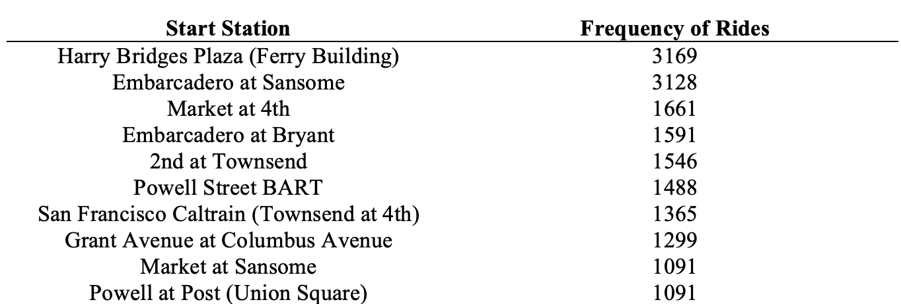

The process for determining the most frequent stations on weekends was largely like the previous analysis except data was filtered to remove weekdays instead of weekends. A new data frame called “rush_hours_wkend” was created, and using the “tidyverse” package, weekdays, which are assigned values of 1 (Monday) to 6 (Friday) were filtered out. The 10 most frequent starting stations on weekends were: Harry Bridges Plaza (Ferry Building), Embarcadero at Sansome, Market at 4th, Embarcadero at Bryant, 2nd at Townsend, Powell Street BART, San Francisco Caltrain (Townsend at 4th), Grant Avenue at Columbus Avenue, Market at Sansome, and Powell at Post (Union Square) **(Table 5)**. 

#### **Table 6:** *Ten most frequent ending stations on weekend.* Frequency of rides represents the numbers of trips finishing at each end station during on weekends.

```{r freq_end_weeke, include=FALSE}
# Most frequent ending stations on weekends
rush_hours_wkend2 <- trip_clean2 %>%
  mutate(end_date_for = mdy_hm(end_date)) %>%
  # Removes everyday except for Sun (1) and Sat (7) from data
  filter(wday(end_date_for) == 1 | wday(end_date_for) == 7) %>%
  mutate(hrs = hour(mdy_hm(end_date))) %>%
  group_by(hrs) %>%
  group_by(end_station_name)

rush_hours_wkend2_tb <- table(rush_hours_wkend2$end_station_name)
rush_hours_wkend2_tb1 <- head(rush_hours_wkend2_tb[order(rush_hours_wkend2_tb,decreasing = TRUE)],10)
```


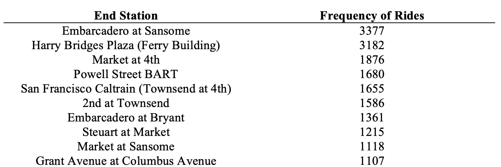

The analysis of the most frequent end stations during weekends was done in the same way as the previous analysis, however, with the replacement of starting station to ending stations data from “trip_clean2” data set. Moreover, the results indicated a large portion of most frequent stations to be very similar to the starting station analysis, however, with slightly different ordering:  Harry Bridges Plaza (Ferry Building), Embarcadero at Sansome, Market at 4th, Embarcadero at Bryant, 2nd at Townsend, Powell Street BART, San Francisco Caltrain (Townsend at 4th), Grant Avenue at Columbus Avenue, Market at Sansome, and Powell at Post (Union Square) **(Table 6)**.

Overall, the most frequent starting/ending stations on weekends and weekdays appeared to closely align with one another. Interestingly, there appears to be a slight discrepancy in stations that are more popular on weekends versus weekdays. For example, some of the top 10 starting stations for weekends included Grant Avenue at Columbus Avenue, Powell at Post (Union Square), Embarcadero at Bryant, Embarcadero at Sansome, and Market at 4th all of which were not included in the top 10 stations starting list on weekdays. For ending stations, top 10 that were not in the ending station analysis for weekends included: Market at 4th, Embarcadero at Bryant, and Grant Avenue at Columbus Avenue. It is worth noting that San Francisco Caltrain (Townsend at 4th) and 2nd at Townsend stations-maintained popularity throughout each analysis.

## **Calculating the Average Utilization of Bikes**

In order to calculate the average utilization of bikes overall per month, a new data frame called “bike_utl”  from the “trip_clean2” data frame was created. Data was first grouped by month and then an additional data frame was created and using the “aggregate” function to sum the total trip durations corresponding to each month. An additional column for the number of days in each month was added as well and a column representing the total seconds in each month which multiplies the days in the month by the average seconds in a day (86400 seconds). The total bike utilization per month was calculated by adding a column that performs a division of total seconds used per month by the total seconds in the given month. Utilization results for each month can be seen in **Table 7**. 

#### **Table 7:** *Total bike utilization per month.* Average utilization was calculated by dividing total duration of trips per month in seconds divided by total time in month in seconds.

```{r bike_utl, include=FALSE, paged.print=FALSE}
# Calculating average utilization of bikes total per month
trip_clean2 <- readRDS("trip_clean2.rds")

bike_utl <- trip_clean2 %>%
  mutate(start_date_for2 = mdy_hm(start_date)) %>%
  group_by(mon = month(start_date_for2))
     
# Summed the duration in seconds of trip starting in each month 
bike_utl2 <- aggregate(bike_utl$duration, by=list(mon = bike_utl$mon), FUN = sum)

bike_utl2 <- bike_utl2 %>%
  # Add column for number of days per month 
 mutate(no_days_per_month = c(31, 28, 31, 30, 31, 30, 31, 31, 30, 31, 30, 31)) %>%
  # Add column with calculation seconds per month (86400 sec / day)
  mutate(sec_per_month = no_days_per_month*86400) %>%
  mutate(avg_utl_per_mon = x/sec_per_month)

```
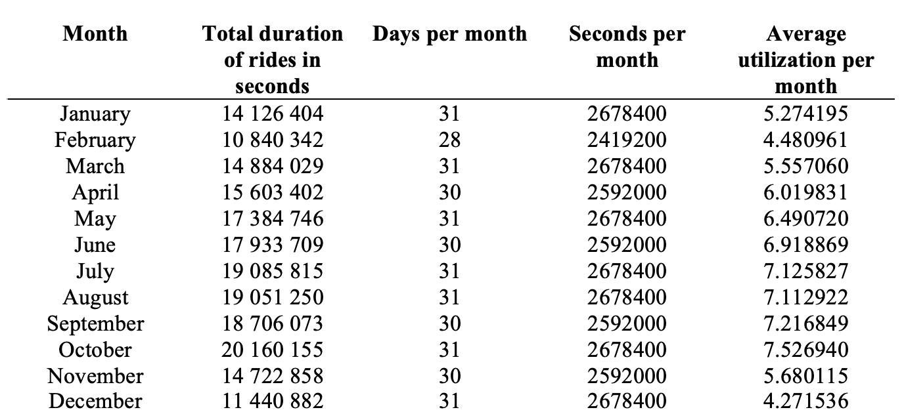

## **Calculating Weather and Bike Rental Patterns**

```{r weather_trip_corr, echo=FALSE}
#Weather and Trip Correlation Plot

#reading in station file 
station_df <- read_csv("station.csv")

#reading in trip data 
trip_clean2 <- readRDS("trip_clean2.rds")
#formating trip start date as.POSIXct format
trip_clean2$start_date <- as.POSIXct(trip_clean2$start_date, format="%d/%m/%y")

#reading in weather data 
weather_df_2 <- readRDS("weather_no_outliers.rds")

################################################################
#Correlation Plot Analysis
################################################################
#Joining station to trip dataset to obtain details on city, will be used afterwards as a UID
#Merged df assigned to station_trip object
station_trip <- left_join(trip_clean2,station_df, by=c("start_station_name" = "name"))
#removing irrelevant variables from dataframe 
station_trip <- station_trip %>% select(-c(id.x, bike_id, start_station_id, 
                                       end_station_id, subscription_type, zip_code,id.y,installation_date,
                                       start_station_name,end_station_name, dock_count, long, lat, end_date, duration))

#creating dataframe grouped by number of trips per day per city, as weather-variables were provided per day
trip_data_count <- station_trip %>% group_by(start_date, city) %>% count() 
#joining the trip and weather data 
trip_weather_corr <- left_join(trip_data_count,weather_df_2, by=c("start_date" = "date", "city"))

```

To determine the impact of weather patterns on bike-rental patterns, the cleaned and filtered data from the previous steps were retrieved. A dataframe with both the trip-data and station-data was then made, using the left_join function. This was performed in order to obtain information regarding the city of each station, which were necessary details since the weather-dataset contained weather patterns based on each city and zipcode, but not according to station-names. After creating this merged dataframe, the variables of id (id.x corresponding to the ID from the trip-dataset), bike-ids, station and end-station ids, subscription-type and zipcodes which were originally from the trip-dataframe were removed and the variables of id (id.y corresponding to the ID from the station-data), installation-date, start-station name, end-station-name, dock-count, long and lat columns were also removed. These variables were removed as they were irrelevant to the analysis of bike-rental frequency and weather-patterns. In order to then obtain the bike-rental frequency, the data was grouped by start-date and city to obtain the total number of counts of bikes used per day per city, as opposed to variables such as duration. It was important to stratify the data by city as well as date, as the weather-data was divided by city, not only date. Therefore, the next step involved joining this newly created dataframe containing the start-date, city, and number of trips per day information with the weather-dataframe. The unique-identifiers in this case were the variables of start-date/date and city. In order to perform correlation analysis with just the numerical variables, all character or factor variables such as start_date, events, and city character-variables were moved. Then, correlation analysis was performed for each of the cities. The events-variable was removed as it was a factor/character-value, and therefore was not included in the quantitative-correlation analysis. For the following correlation plots, freq refers to the number of trips completed per day. 

#### **Figure 6:** *Correlation Plot for San Francisco.*

```{r cor_san_fran, include=FALSE}
#Correlation for San Francisco
#creating dataframe for San Francisco city  
san_fran <- as.data.frame(trip_weather_corr %>% filter(city == "San Francisco"))
san_fran <- san_fran %>%
  #removing character-variables
  select(-c(start_date, city, zip_code, events)) %>%
  #coding cloud cover as numeric 
  mutate(cloud_cover = as.numeric(cloud_cover)) %>%
  #removing any remaining NA
  filter(!is.na(max_visibility_miles)) %>%
  #removing any remaining NA
  filter(!is.na(max_gust_speed_mph))
#displaying correlation values 
corrplot(cor(san_fran))

```

For San Francisco as can be seen in **Figure 6**, a positive but weak correlation can be observed for the variables of max-temperature-f and mean-temperature, and a negative moderate correlation for precipitation inches, as well as a weaker negative correlation for maximum and minimum wing speed, and cloud-cover. 

#### **Figure 7:** *Correlation Plot for Mountain View.*

```{r cor_mount_view, include=FALSE}

#mountain view city 
mountain_view <- as.data.frame(trip_weather_corr %>% filter(city == "Mountain View"))
mountain_view <- mountain_view %>%
  #removing character-variables
  select(-c(start_date, city, zip_code, events)) %>%
  #coding cloud cover as numeric 
  mutate(cloud_cover = as.numeric(cloud_cover)) %>%
  #removing any remaining NA
  filter(!is.na(max_visibility_miles)) %>%
  #removing any remaining NA
  filter(!is.na(max_gust_speed_mph))
#displaying correlation values 
corrplot(cor(mountain_view))

```
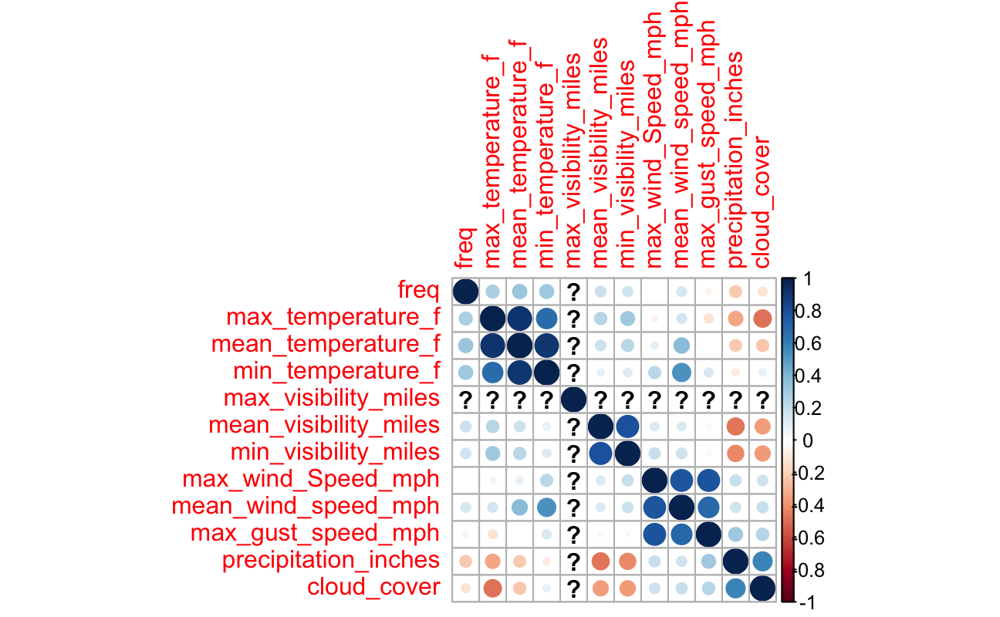


For the city of Mountain View as can be seen in **Figure 7**, a positive but weak correlation can be seen for the variables of max-temperature-f and mean-temperature and weak negative correlations for the variables of max/mean wind speed, and gust speed. The variables of cloud-cover and precipitation inches demonstrate a marginally better, borderline moderate negative correlation. 


#### **Figure 8:** *Correlation Plot for Palo Alto.*

```{r cor_palo_alto, include=FALSE}
#palo alto city 
palo_alto_view <- as.data.frame(trip_weather_corr %>% filter(city == "Palo Alto"))
palo_alto_view <- palo_alto_view %>%
  #removing character-variables
  select(-c(start_date, city, zip_code, events)) %>%
  #coding cloud cover as numeric 
  mutate(cloud_cover = as.numeric(cloud_cover)) %>%
  #removing any remaining NA
  filter(!is.na(max_visibility_miles)) %>%
  #removing any remaining NA
  filter(!is.na(max_gust_speed_mph))
#displaying correlation values 
corrplot(cor(palo_alto_view))
```
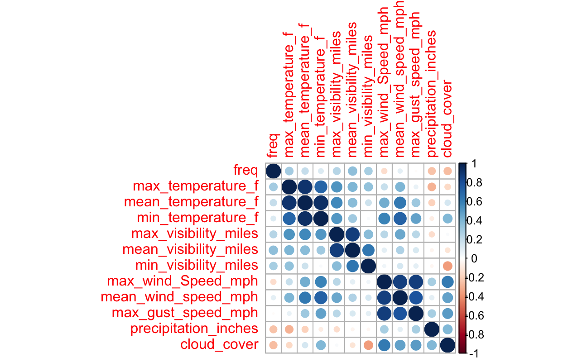
The city of Palo Alto similarly showed a weak positive correlation for max and mean temperature, as well as for minimum visibility in miles, and a weak negative correlation for minimum visibility and precipitation inches, as well as for events-types and gust-speed. However, a moderate negative correlation for maximum and average wind speed, as well as cloud cover. Interestingly, there were not any variables that were insufficient for correlation analysis, seen by the lack of ‘?’ compared to the other plots for the other cities as seen in **Figure 8**. 

#### **Figure 9:** *Correlation Plot for Redwood City.*  

```{r cor_redwood_city, include=FALSE}
#Redwood City
redwood_city <- as.data.frame(trip_weather_corr %>% filter(city == "Redwood City"))
redwood_city <- redwood_city %>%
  #removing character-variables
  select(-c(start_date, city, zip_code, events)) %>%
  #coding cloud cover as numeric 
  mutate(cloud_cover = as.numeric(cloud_cover)) %>%
  #removing any remaining NA
  filter(!is.na(max_visibility_miles)) %>%
  #removing any remaining NA
  filter(!is.na(max_gust_speed_mph))
#displaying correlation values 
corrplot(cor(redwood_city))
```
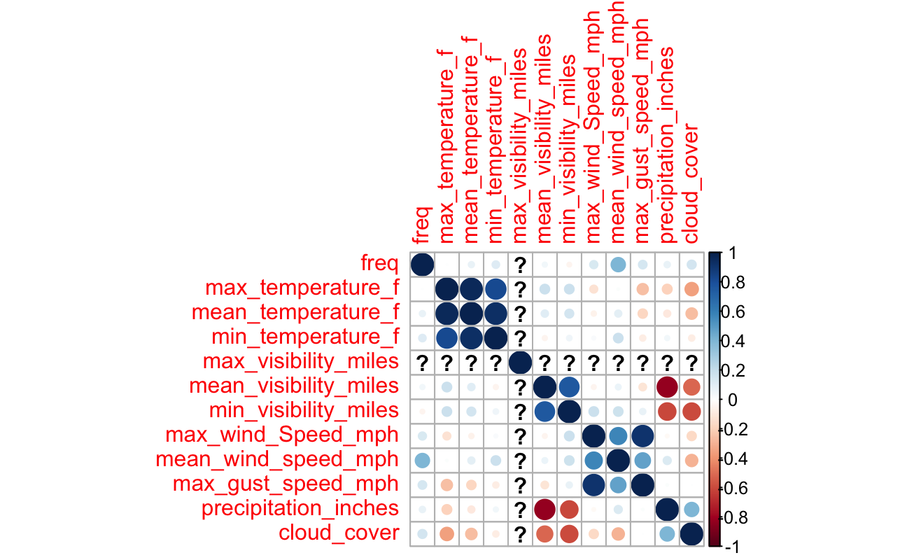
As seen in **Figure 9**, which displays the correlation plot for Redwood City, there is only weak positive correlation shown for all variables, with the exception of average wind speed, which shows a borderline-moderate correlation. 

#### **Figure 10:** *Correlation Plot for San Jose.*

```{r cor_san_jose, include=FALSE}
#San Jose City
sanjose_city <- as.data.frame(trip_weather_corr %>% filter(city == "San Jose"))
sanjose_city <- sanjose_city %>%
  #removing character-variables
  select(-c(start_date, city, zip_code, events)) %>%
  #coding cloud cover as numeric 
  mutate(cloud_cover = as.numeric(cloud_cover)) %>%
  #removing any remaining NA
  filter(!is.na(max_visibility_miles)) %>%
  #removing any remaining NA
  filter(!is.na(max_gust_speed_mph))
#displaying correlation values 
corrplot(cor(sanjose_city))
```
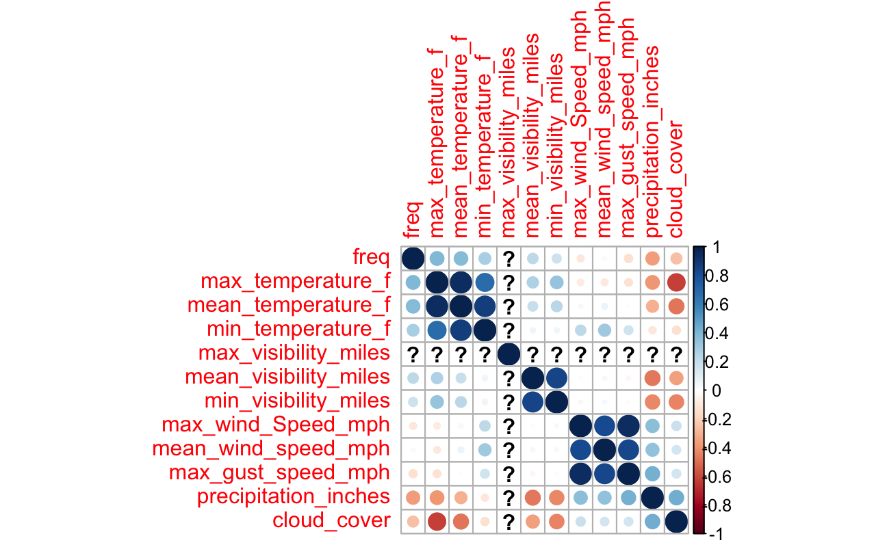
For the town of San Jose as shown in **Figure 10**, there are weak positive correlations shown for the mean and minimum visibility variables, with borderline moderate correlation for the max/mean/min temperature variables. Moreover, a weak negative correlation for max/mean wind speeds and gust-speeds with cloud cover, and for precipitation inches is also seen. 

To provide a summary of the weather patterns for all these plots, all the cities demonstrate a weak-positive correlation associated with the max/min/mean temperature variables where increased frequency of bike rides are associated with increased temperature. In addition, this correlation was also shown to be true for the max/minimum/mean visibility (miles) variables, where increased visibility is associated with increased frequency of bike rides. On the other hand, weak-negative correlations are demonstrated with the speed variables, where increasing speed is associated with lower frequency of bike rides. In addition to this, weak-negative correlations were exhibited for precipitation, where increased precipitation is associated with lower frequency of bike rides. Similar to this variable, greater-cloud-cover values being associated with lower frequency of bike rides. These trends were however not noticed in Redwood City, where increased frequency of bike rides were associated not only with greater temperatures but also, negative weather events such as greater wind-speed and greater precipitation or cloud-cover. 


## **Conclusion**

The analysis concluded that the common rush hours during weekdays were 8:00 - 8:59 am, 9:00 - 9:59 am and 5:00 - 5:59pm. These results were consistent for both starting and ending stations and likely align with workday patterns of the average worker in the Bay Area. Overall, the bike starting and ending stations on weekdays aligned well. There were discrepancies in the most popular stations for weekends in comparison to weekdays. Specifically, the Market at 4th, Embarcadero at Bryant, and Grant Avenue at Columbus Avenue stations seemed to be busier on the weekends in comparison to weekdays. Interestingly, San Francisco Caltrain (Townsend at 4th) and 2nd at Townsend stations-maintained popularity throughout each analysis. In addition, an increase in utilization of bikes is seen in the months of July – October. Conversely, a decrease in utilization was seen in December, January, and February.  When it comes to the expected weather patterns, weather events thought to be associated with the months of July – October include increased temperatures and greater visibility, along with lower wind-speeds and lower precipitation with the converse expected to present in December, January, and February. The analysis of weather patterns also supports the previous results, where greater frequency of bike rides were shown to be associated with positive or increasing values for temperatures and greater visibility as opposed to lower frequency with greater wind-speeds and precipitation values. However, due to the limitations of missing data which necessitated missing-value imputation for the weather and trip-information, further analysis to determine the impact of weather patterns on bicycle utilization could be helpful to inform maintenance decisions. 


## GRADING

**.RMD Completeness:** 2/2 - able to knit without errors

**Packages:** 2/2 - all packages are loaded

**Text Formatting:** 2/2 - contains headers and properly formatted text

**Output Formatting:** 2/2 - code outputs are properly formatted for printing/viewing. outputs are disabled for appropriate chunks.

**Code Chunks:** 2/2 - 	code is chunked appropriately. code chunks are named and options sets where necessary. code is commented.

**TOTAL GRADE: 10/10** Nice job!